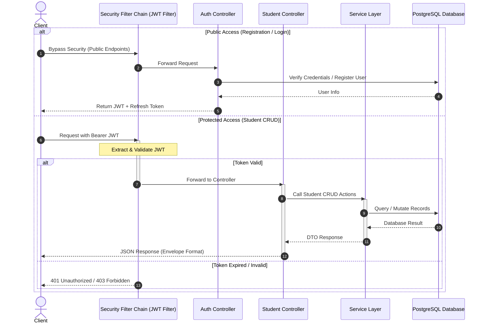

# 🎓 Student Management REST API


A production-ready, highly secure RESTful API built on Spring Boot for managing student profiles and records. This system features modern stateless JWT access tokens, robust database refresh token rotation, automatic data seeding, detailed SLF4J audit logging, containerization via Docker/Docker-compose, and full Swagger/OpenAPI interactive documentation.

---

## 🏛️ System Architecture & Data Flow

This diagram illustrates how client requests are processed, authenticated via Spring Security, and routed to the database.



---

## 🚀 Key Features

*   **🔒 Secure Stateless Authentication**: Fully secured with Spring Security and cryptographic **JWT Access Tokens**.
*   **🔄 Refresh Token Rotation (RTR)**: Stateful random UUID-based session refresh, with automatic token rotation on every exchange to defend against session replay attacks.
*   **🎓 Complete CRUD Capabilities**: Fully validated endpoints for creating, retrieving, updating, and deleting student records.
*   **🌱 Automatic Database Seeder**: Programmatic database seeder that seeds 100 unique, realistic student records into PostgreSQL on first start if the database is empty.
*   **📝 SLF4J & Logback Audit Logging**: Logs every CRUD action mapping operations to timestamp, operation type, student ID, and email, with rolling logs stored in `logs/application.log`.
*   **🐳 Containerized Environment**: Simple multi-stage `Dockerfile` and a multi-container `docker-compose.yml` for database and application isolation.
*   **📖 Interactive API Documentation**: Live interactive endpoints testing via Swagger UI.

---

## 🛠️ Tech Stack & Dependencies

| Tech / Library | Version | Description |
| :--- | :--- | :--- |
| **Java** | 17 | Core language platform. |
| **Spring Boot** | 3.2.5 | Modern backend application framework. |
| **Spring Security** | 3.2.5 | Custom stateless request filters and auth manager. |
| **JSON Web Token (JJWT)** | 0.12.5 | Modern cryptographic token builder and parser. |
| **PostgreSQL** | 15 | Persistent SQL database driver. |
| **Spring Doc OpenAPI** | 2.5.0 | Interactive API Documentation engine. |
| **Lombok** | 1.18.30 | Boilerplate code reduction library. |
| **Docker** | 3.8 | Multi-container isolation. |

---

## 📁 Project Structure

Below is the layout of the project, detailing how files and components are structured:

```text
project-01/
├── src/
│   ├── main/
│   │   ├── java/com/example/student/
│   │   │   ├── config/             # Configuration classes (Web, Database Seed, OpenAPI)
│   │   │   ├── controller/         # REST Controllers (Auth, Student)
│   │   │   ├── dto/                # Request & Response Data Transfer Objects
│   │   │   ├── exception/          # Global Exception Handler and custom exceptions
│   │   │   ├── model/              # JPA Entities (User, Student, RefreshToken, Role)
│   │   │   ├── repository/         # Spring Data JPA Repositories
│   │   │   ├── security/           # Custom Jwt Filter, Services, & Security Config
│   │   │   ├── service/            # Service interfaces
│   │   │   │   └── impl/           # Service implementation details
│   │   │   └── StudentApplication.java # Application entry point
│   │   └── resources/
│   │       ├── application.properties  # Database and JWT configurations
│   │       ├── data.sql                # Initial data (if applicable)
│   │       └── logback-spring.xml      # Logger configuration (Rolling file settings)
│   └── test/                       # Unit and Integration tests
├── docs/                           # Documentation resources
│   └── postman_collection.json     # Postman collection API tests
├── Dockerfile                      # Application docker build file
├── docker-compose.yml              # DB and App compose config
├── start.bat                       # Local execution bootstrapper
├── kill_port_8080.bat              # Port cleaning tool (terminates port 8080 processes)
├── pom.xml                         # Maven dependencies config
└── README.md                       # Documentation
```

---

## 📡 API Endpoints

### 🔐 Authentication Operations (Public)

| HTTP Method | Endpoint | Description |
| :--- | :--- | :--- |
| `POST` | `/api/v1/auth/register` | Registers a new user account (returns JWT credentials). |
| `POST` | `/api/v1/auth/login` | Authenticates existing credentials (returns JWT credentials). |
| `POST` | `/api/v1/auth/refresh` | Rotates expired access token using a valid refresh token. |

### 🎓 Student Management Operations (Protected - Requires Bearer JWT)

| HTTP Method | Endpoint | Description |
| :--- | :--- | :--- |
| `GET` | `/api/v1/students` | Fetch a paginated, sorted list of all student records. |
| `GET` | `/api/v1/students/{id}` | Retrieve details of a specific student using their unique ID. |
| `GET` | `/api/v1/students/search?email={email}` | Search for a student by their unique email. |
| `POST` | `/api/v1/students` | Create a brand new student record in the database. |
| `PUT` | `/api/v1/students/{id}` | Update details of an existing student by ID. |
| `DELETE` | `/api/v1/students/{id}` | Remove a student record permanently. |

### 🧠 AI-Powered Operations (Protected - Requires Bearer JWT & Rate-Limited)

| HTTP Method | Endpoint | Description |
| :--- | :--- | :--- |
| `GET` | `/api/v1/ai/students/{id}/study-plan` | Generates a 3-month study plan for a specific student. |
| `POST` | `/api/v1/ai/students/nl-search` | Filters students based on natural language query inputs. |
| `GET` | `/api/v1/ai/analytics/insights` | Generates detailed narrative analysis stats reports. |
| `GET` | `/api/v1/ai/students/at-risk` | Audit students to find high, medium, or low risk cases. |
| `POST` | `/api/v1/ai/chat` | Contextual chatbot backed by database aggregate metrics. |
| `POST` | `/api/v1/ai/students/email-content` | Generate bulk personalized email drafts in parallel (max 50). |
| `GET` | `/api/v1/ai/reports/monthly` | Stream strategic summaries into downloadable PDFs (iText7). |

---

## 🧠 AI-Powered Features (Claude AI Integration)

This system integrates **Anthropic Claude (Messages API)** to upgrade CRUD capabilities with intelligence.

### 🔑 Anthropic API Key Setup
To enable AI operations, obtain a key from the **[Anthropic Console](https://console.anthropic.com)** and pass it into the application:
- **Local Dev**: Add `CLAUDE_API_KEY=your_key` in your `.env` file.
- **Docker Dev**: Set `CLAUDE_API_KEY` on your host machine before running `docker-compose up --build`.

### 🛡️ Resilience & Production Hardening
- **⏳ Rate Limiting**: All `/api/v1/ai/**` routes are protected by a Bucket4j filter allowing up to **60 requests per minute per user**.
- **⚡ Cache Layer**: Caching is driven by **Caffeine** with a max size of `500` entries and a time-to-live (TTL) of `10 minutes` for study plans and analytics. Cache hits return `"cachedResponse": true`.
- **🔌 Circuit Breaker**: Resilience4j isolates Claude API calls. If failures exceed **50%** in a sliding window of **10** requests, the breaker trips to `OPEN` for **30 seconds** and fails gracefully returning: 
  `"AI service is temporarily unavailable. Please try again in a moment."`

---

## 📦 Request / Response Formats

### Create Student Request (`POST /api/v1/students`)
```json
{
  "firstName": "John",
  "lastName": "Doe",
  "email": "john.doe@example.com",
  "phone": "+91-9999888877",
  "course": "Computer Science",
  "age": 21
}
```

### Success Response Envelope Format (`200 OK`)
```json
{
  "status": "success",
  "message": "Student created successfully",
  "data": {
    "id": 101,
    "firstName": "John",
    "lastName": "Doe",
    "email": "john.doe@example.com",
    "phone": "+91-9999888877",
    "course": "Computer Science",
    "age": 21,
    "createdAt": "2026-05-31T22:08:19.452",
    "updatedAt": "2026-05-31T22:08:19.452"
  }
}
```

---

## ⚙️ Environmental Variable Settings

Configure your environment settings using a `.env` file in the root directory. You can use the template inside **[.env.example](file:///c:/Users/HP/Desktop/demo/project-01/.env.example)**:

```properties
DB_URL=jdbc:postgresql://localhost:5432/student_db
DB_USERNAME=postgres
DB_PASSWORD=yourpassword
```
*(The application features safe fallback values so it compiles and boots locally out-of-the-box even if these variables are empty!)*

---

## 🚀 How to Run the Application

### Option A: Local Machine Execution

#### 1. Setup PostgreSQL Database
Ensure a local PostgreSQL instance is running and create the database:
```sql
CREATE DATABASE student_db;
```

#### 2. Run the App using Bootstrapper
Run the pre-configured script in the root directory to clean compile, run unit tests, and start the local Spring Boot application:
```cmd
start.bat
```
*(Hibernate will automatically generate tables and push the 100 realistic student entries upon first boot).*

#### 🛠️ Troubleshooting Port Conflicts
If you receive a build error stating **`Port 8080 was already in use`** (which occurs if a background Spring Boot process or another local server is holding the port open), run the automated port cleaner script in the root directory before running the bootstrapper:
```cmd
kill_port_8080.bat
```
This utility automatically detects and terminates any active processes binding port `8080`, instantly clearing the port for the application server.

---

### Option B: Docker Container Execution (Zero Setup)
You do not need Java, Maven, or PostgreSQL installed locally on your system to run this application.

#### 1. Build and Run Container Orchestration
Ensure you have Docker Desktop running. Run the following command from the project root folder:
```bash
docker-compose up --build
```
Docker will:
1. Initialize the PostgreSQL container.
2. Compile and package the Spring Boot jar inside a temporary Maven build stage.
3. Package the final lightweight executable jar in the final `openjdk:17-jdk-slim` container.
4. Launch both and expose port `8080` to the host system.

---

## 📖 Live API Documentation & Testing

### 1. Swagger UI
Once the application is running (locally or on Docker), open the following URL in your web browser:
🔗 **[Swagger UI Documentation](http://localhost:8080/swagger-ui.html)**

Click on the **"Authorize"** button at the top-right of the Swagger page, paste your active Bearer JWT token, and you can invoke all protected APIs directly from the browser!

### 2. Postman Collection
A fully configured Postman collection is available to quickly test and interact with all the API endpoints.
- Location: [Student_API.postman_collection.json](file:///c:/Users/HP/Desktop/demo/project-01/Student_API.postman_collection.json)
- **Import steps**:
  1. Open Postman.
  2. Click **Import** at the top left.
  3. Drag and drop or browse to import `Student_API.postman_collection.json`.
  4. The collection includes pre-configured environment variables for easy setup. Once logged in, the bearer token will automatically populate for protected calls!

---

## 📑 API Response Examples

This section displays actual successful JSON responses from verified local executions for every core API endpoint.

### 1. User Registration (`POST /api/v1/auth/register`)
```json
{
  "status": "success",
  "message": "User registered successfully",
  "data": {
    "accessToken": "eyJhbGciOiJIUzI1...",
    "refreshToken": "e7c7a912-70b9-4785-84fe-19a9d5926ecf",
    "tokenType": "Bearer",
    "email": "test@example.com",
    "role": "ROLE_USER"
  }
}
```

### 2. User Login (`POST /api/v1/auth/login`)
```json
{
  "status": "success",
  "message": "Authentication successful",
  "data": {
    "accessToken": "eyJhbGciOiJIUzI1...",
    "refreshToken": "e7c7a912-70b9-4785-84fe-19a9d5926ecf",
    "tokenType": "Bearer",
    "email": "test@example.com",
    "role": "ROLE_USER"
  }
}
```

### 3. Create Student (`POST /api/v1/students`)
```json
{
  "status": "success",
  "message": "Student created successfully",
  "data": {
    "id": 1,
    "firstName": "Rahul",
    "lastName": "Kumar",
    "email": "rahul@example.com",
    "phone": "9876543210",
    "course": "Computer Science",
    "age": 20,
    "createdAt": "2026-05-31T23:13:30.123",
    "updatedAt": "2026-05-31T23:13:30.123"
  }
}
```

### 4. Get All Students Paginated (`GET /api/v1/students`)
```json
{
  "status": "success",
  "message": "Students retrieved successfully",
  "data": {
    "content": [
      {
        "id": 1,
        "firstName": "Rahul",
        "lastName": "Kumar",
        "email": "rahul@example.com",
        "phone": "9876543210",
        "course": "Computer Science",
        "age": 20,
        "createdAt": "2026-05-31T23:13:30.123",
        "updatedAt": "2026-05-31T23:13:30.123"
      }
    ],
    "pageable": {
      "pageNumber": 0,
      "pageSize": 10,
      "sort": {
        "empty": false,
        "sorted": true,
        "unsorted": false
      },
      "offset": 0,
      "paged": true,
      "unpaged": false
    },
    "last": true,
    "totalElements": 1,
    "totalPages": 1,
    "size": 10,
    "number": 0,
    "first": true,
    "numberOfElements": 1,
    "empty": false
  }
}
```

### 5. Get Student by ID (`GET /api/v1/students/1`)
```json
{
  "status": "success",
  "message": "Student retrieved successfully",
  "data": {
    "id": 1,
    "firstName": "Rahul",
    "lastName": "Kumar",
    "email": "rahul@example.com",
    "phone": "9876543210",
    "course": "Computer Science",
    "age": 20,
    "createdAt": "2026-05-31T23:13:30.123",
    "updatedAt": "2026-05-31T23:13:30.123"
  }
}
```

### 6. Update Student (`PUT /api/v1/students/1`)
```json
{
  "status": "success",
  "message": "Student updated successfully",
  "data": {
    "id": 1,
    "firstName": "Rahul Updated",
    "lastName": "Kumar",
    "email": "rahul@example.com",
    "phone": "9876543210",
    "course": "Java Development",
    "age": 21,
    "createdAt": "2026-05-31T23:13:30.123",
    "updatedAt": "2026-05-31T23:14:15.456"
  }
}
```

### 7. Delete Student (`DELETE /api/v1/students/1`)
```json
{
  "status": "success",
  "message": "Student deleted successfully",
  "data": null
}
```

---

## 📄 License

Distributed under the MIT License. See `LICENSE` for more information.
